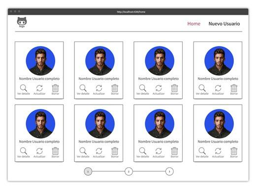
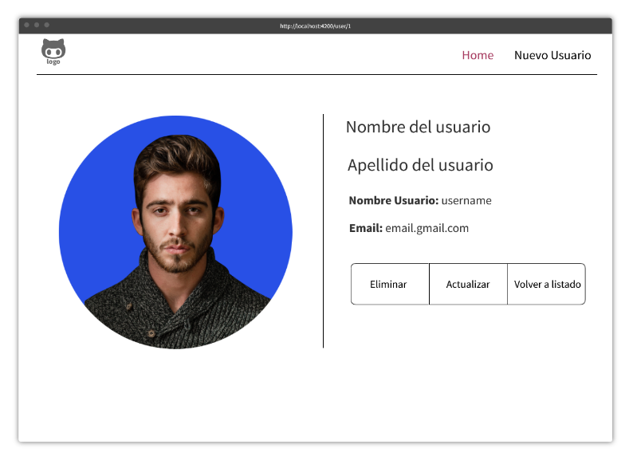
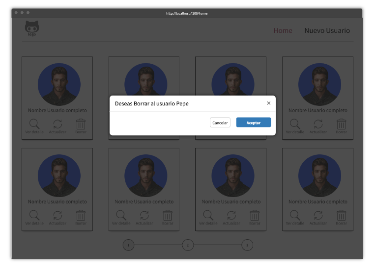
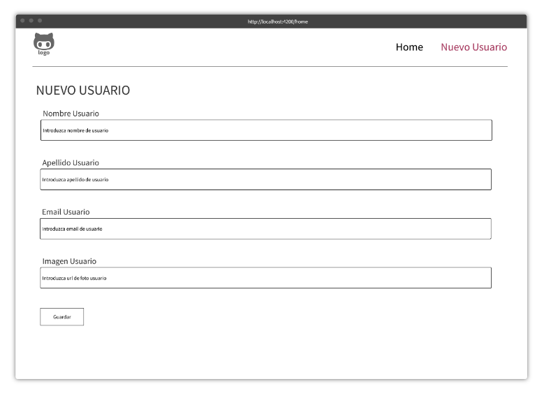
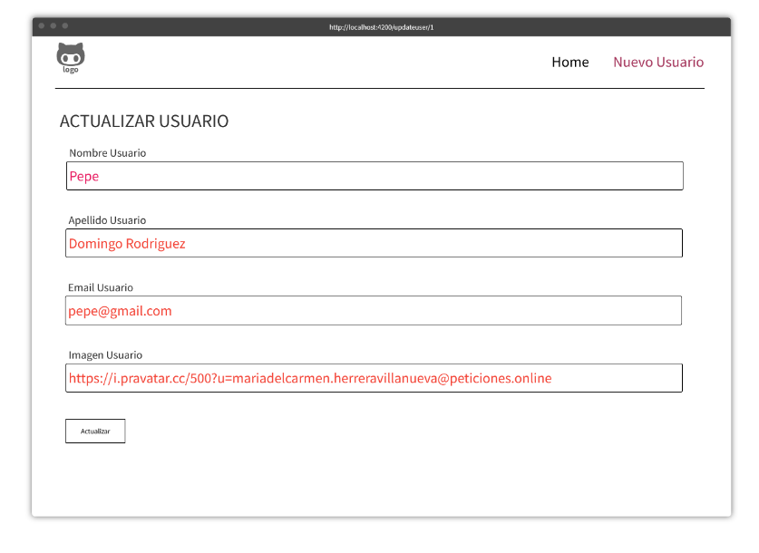

# Actividad 6: Aplicación consultando a API Externa

## Objetivos

Con esta actividad vas a conseguir desarrollar en Angular completo con un sistema de componentes y rutas funcional que se conecta a un servicio de BBDD a través de una api externa.

Los objetivos para cumplir en esta práctica son los siguiente:

- Averiguar cuantos componentes necesitamos y crearlos.
- Crear el sistema de rutas para cada componente.
- Crear componentes hijos si lo consideras necesario.
- Comunicar los componentes a través de los medios necesarios para que los datos lleguen a cada uno de los elementos.
- El trabajo con formularios y validaciones.

## Pautas de elaboración

Crear una aplicación con Angular que tenga sistema de rutas y cargue CSS. Una vez que la aplicación este creada debéis cargar Bootstrap como framework de css para que os ayude a maquetar todo el sistema de componentes.

El api que vas a consultar es la siguiente:

<https://peticiones.online/users>

Este api tiene los métodos/endpoints necesarios para resolver la práctica.

La aplicación cargará inicialmente una página inicial donde ser cargará el listado de usuarios completo.

La aplicación tendrá las siguientes rutas:

- **/home**: donde ser cargará el listado de usuarios completo.

- **/user/1**: donde ser cargará la vista de usuario con todos sus datos. Nótese que el numero de la ruta corresponde al id del usuario.

- **/newuser**: donde ser cargará un formulario que dará de alta un usuario siguiendo el patron del api de creater user.

- **/updateuser/1**: se cargará reutilizando el formulario de registro los datos del usuario a actualizar para que se pueda actualizar los datos y mandárselos al api.

**IMPORTANTE:** el api es de pruebas luego la respuesta que ofrece sobre todo al tema de crear y actualizar están mockeadas (no son reales) pero os servirá para recoger la respuesta y gestionar correctamente los avisos al usuario. La creación de usuarios no generará usuarios nuevos, pero si te devolverá el usuario con su id creado.

En el home pintareis un listado de usuarios en formato GRID.

El Wireframe de bajo nivel que representa la vista del home, sería algo como esto.

Figura 1. Pantalla home. Fuente: elaboración propia.

En esta pantalla veréis que hay un grid de usuarios donde se muestra la foto del usuario, el nombre y tres botones de **Ver detalle, Borrar y Actualizar.**

Si pulsáis a ver detalle la página redireccionará a la siguiente ruta **(user/1)** y cargáis la vista del usuario que sigue la estructura de este wireframe.

Figura 2. Pantalla usuario. Fuente: elaboración propia.

En esta pantalla deberéis mostrar toda la información del usuario que os sirva el api proporcionado. Además, esta pantalla tendrá tres botones.

- Uno de volver a listado que me permitirá volver al listado completo de usuarios.
- Otro que me llevará al formulario de edición del usuario. (Actualizar).
- Y el botón de eliminar que lanzará un mensaje de alerta avisándonos que vamos a eliminar el usuario X.

Figura 3. Pantalla borrar usuario. Fuente: elaboración propia.

En esta vista podéis ver una pantalla de confirmación, si das a aceptar se produce el envío al api y si das a cancelar vuelves a la pantalla del usuario. (Nota podéis realizar este popup con librerías de investigación por vuestra parte como sweetAlert o con el aviso de confirm típico de JavaScript)

Esta misma interacción deberá ocurrir si hacemos click en el botón de borrar del listado de usuarios.

Figura 4. Pantalla borrar usuario home. Fuente: elaboración propia.

**NOTA**: En la documentación del api en la url que hemos puesto al principio tenéis los mensajes de Response (correcto) y Error para que los podáis gestionar dentro del vuestro frontEnd.

El botón de Nuevo Usuario que está en menú de nuestra página carga el formulario de dar de alta un usuario.

**NOTA**: Os recuerdo que el api que manejamos es de prueba y la respuesta que nos devuelve son válidas, pero no se ejecutan, es decir no esperéis que el usuario se añada a lista. La respuesta del api nos dará un OK o un KO dependiendo de si se ha ejecutado o no.

Este formulario necesitará de validaciones para que todos los campos sean rellenados obligatoriamente, se comprobará que el email es válido y la imagen será una ruta de un imagen que uséis de internet (no será un archivo físico).

El wireframe del formulario será de la siguiente forma:

Figura 5. Pantalla crear nuevo usuario. Fuente: elaboración propia.

Este mismo componente se deberá usar para la actualización del usuario, es decir cuando demos en el botón actualizar del usuario, deberá cargar este mismo componente, pero con el texto actualizar usuario y el botón en lugar de guardar debe poner Actualizar.

Si pulsamos en el botón de Actualizar usuario este formulario debe aparecer relleno de tal forma que se pueda editar y modificar para ser actualizado de la siguiente forma. Ojo los campos están en rojo para remarcar no porque el resultado tenga que esta así.

Figura 6. Actualizar usuario. Fuente: elaboración propia.

Y con este paso se completará un CRUD (Create Read Update Delete) completo desde angular contra una API, externa. Es el mismo proceso que se realiza en un ejemplo fullstack lo que pasa es que esta vez los endpoint del Backend no están realizado por vosotros.

Recordar crear los interfaces y servicios para realizar todas las peticiones e importar el app.module los elementos necesarios para hacer toda la aplicación.

## Extensión y formato

Se deberá entregar la práctica a través de tu perfil de GitHub, es decir tendrás que ir realizando la práctica y haciendo control de versiones con ella en GIT para finalmente subir la práctica a tu repositorio de GitHub de forma pública y publicarás el enlace en la zona de entrega del ejercicio.

De forma paralela entregarás todos los archivos del proyecto, sin la carpeta node_modules, en un zip en el área designada para la entrega de las prácticas en el campus, junto con el enlace de GitHub mencionado antes.

## Rúbrica

|                                      |                                                                                                                     |                                   |               |
| ------------------------------------ | ------------------------------------------------------------------------------------------------------------------- | --------------------------------- | ------------- |
| Aplicación consultando a API Externa | Descripción                                                                                                         | Puntuación máxima  (puntos) | Peso  % |
| Criterio 1                           | Creación del proyecto.                                                                                              | 1                                 | 10%           |
| Criterio 2                           | Creación de rutas y componentes.                                                                                    | 1.5                               | 15%           |
| Criterio 3                           | Creación de interfaces y servicios para conectar al api.                                                            | 1.5                               | 15%           |
| Criterio 4                           | Vista home con la carga de todos los usuarios.                                                                      | 1.5                               | 15%           |
| Criterio 5                           | Vista detalle del usuario con todos sus datos y los botones correspondientes.                                       | 1.5                               | 15%           |
| Criterio 6                           | Vista formulario de nuevo registro de usuario y su funcionalidad conectada con el api.                              | 1.5                               | 15%           |
| Criterio 7                           | Actualización del usuario reutilizando el componente formulario del registro y conectarlo correctamente con el api. | 1.5                               | 15%           |
|                                      |                                                                                                                     | **10**                            | **100 %**     |
